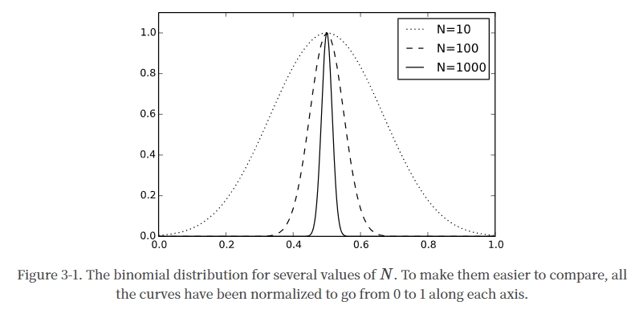

# 斯坦福大学热统 

2023-6-6 23:35:18

## 评论

TODO:授课顺序，授课重点，授课理念

## 知识图谱

TODO:知识点

### A 核心知识点

#### A1 微观态与宏观态

- 态密度
  一个宏观状态所对应的微观状态的数量被称为状态密度。它被写成$\Omega(E,V,...)$，其中参数是定义宏观状态的宏观变量。

- 等概率假设
  一个系统处于与其当前宏观状态一致的任何微观状态的概率是相等的。

- 时间平均与系综平均
  时间平均量和系综平均量相等的系统被称为是遍历性的。

- 玻尔兹曼分布与配分函数
  玻尔兹曼分布是一个系统处于某个微观状态的概率与该微观状态的能量成指数关系的分布。
  $p(E)=\dfrac{\mathrm{e}^{-E/kT}}{Z}$
- 热力学势
  我们现在知道如何计算在许多不同种类的状态下发现一个系统的概率：微观状态或宏观状态，由任意的宏观变量集指定。在每一种情况下，概率都采取完全相同的形式：
  $$
  p=\dfrac{\mathrm{e}^{-\Phi/kT}}{Z}
  $$
  几个最常见的热力学势有特殊的名称：
  $$
  \begin{aligned}
  H&=U+PV\quad\text{Enthalpy}\\
  F&=U-TS\quad\text{Helmholtz free energy}\\
  G&=U+pV-TS\quad\text{Gibbs free energy}\\
  \Phi_G&=U-\mu N-TS\quad\text{Grand potential}\\
  \end{aligned}
  $$

  - **微正则系综**是指能量恒定的孤立系统。

  - **正则系综**是指在特定温度下可以与热浴交换能量的系统。

  - **巨正则系综**是指一个可以在特定温度和化学势的热浴中交换能量和粒子的系统。

  > 这些名字纯属历史。它们没有任何特定的含义，但它们仍然被广泛使用，所以你需要了解它们。

#### A2 统计与量子统计

- 均值与方差
  $$
  \begin{aligned}
  \langle A\rangle&=\sum_{i=1}^Np_iA_i\\
  \langle A^2\rangle&=\sum_{i=1}^Np_iA_i^2\\
  \sigma_A^2&=\langle A^2\rangle-\langle A\rangle^2
  \end{aligned}
  $$

- 期望

  $$
  \left\langle \Phi\right\rangle=-\dfrac{\partial{\log{Z}}}{\partial{\beta}}\\
  \left\langle \dfrac{\partial{\Phi}}{\partial{x}}\right\rangle=-kT\dfrac{\partial{\log{Z}}}{\partial{x}}
  $$

- 量子统计

  在处理量子系统时，我们需要注意区分不同类型的概率。在统计力学中，概率总是指系综平均或时间平均。一个变量具有一个特定值的 "概率 "指的是一个系综微观态的一部分，或者是一个时间的一部分。但是，量子力学也有自己的概率，甚至当系统处于单一的已知状态时也适用。它们描述了在系统处于特定状态下，测量将产生某种结果的概率。

  在任何情况下，当把统计力学应用于量子系统时，一定要把由于统计系综的 "概率 "和由于量子力学本身的 "概率 "区分开来。

#### A3 热力学极限

- “硬币”分布 (二项分布)
  
  
  **涨落**为 $\dfrac{\sigma}{\left\langle m\right\rangle}=\dfrac{1}{\sqrt{N}}$

- 中心极限定理

#### A4 统计量

- 温度
  
  能量均分定理：$E=\dfrac{kT}{2}$. 即每个自由度的平均能量为$\dfrac{kT}{2}$

- 热力学势的微观视角和宏观视角

- 热力学势和热力学力
  $$
  \begin{aligned}
  Q = -\dfrac{\partial{U}}{\partial{x}}\\
  W = Q\Delta{x}
  \end{aligned}
  $$

- 热平衡

- 广延量和强度量

#### A5 热力学

- 热力学过程
  改变系统并允许其平衡的整个过程被称为热力学过程。
  
  - 孤立系统
    其宏观属性，如能量和体积，是固定和不变的。

  - 热浴接触的系统
    该系统的属性由热浴的属性决定。它们可以自由变化，但它们是随机变化的，而且大多只在一个狭窄的范围内。另外，如果我们把感兴趣的系统加上热浴看作一个单一的复合系统，那么这个复合系统仍然是孤立的。

  - 可控系统
  当我们选择以我们选择的方式改变它们时，它们就会发生变化。我们不再以任何方式处理一个孤立的系统。我们正在明确地进行外部改变，从外部伸手来改变这个系统。另一方面，我们只在一个有限的时间段内这样做。在我们做出改变之前，系统（可能包括一个热浴）是隔离的。在我们做完改变之后，它又被隔离了。但是在我们进行改变的时候，它是不被隔离的。

- 热力学定律
  
  - 热力学第零定律
    如果两个物体都与第三个物体处于热平衡，那么它们也彼此处于热平衡。
  
  - 热力学第一定律
    一个系统在热力学过程中的能量变化等于添加到该系统的热量减去它对其环境所做的功。在微分形式中，这被写成
    $$
    \mathrm{d}U=\delta Q-\mathrm{d} W
    $$
    其中$Q$表示热量和$W$代表做功。

  - 热力学第二定律
    在任何热力学过程中，总熵要么增加，要么保持不变，但从不减少。

    *或*

    热量永远不会自发地从较冷的物体流到较热的物体。

  - 热力学第三定律
    当任何系统的温度接近零时，它的熵接近一个最小值。

- 热容
  $$
  C=\dfrac{\partial{Q}}{\partial{T}}
  $$

  等容热容$C_V$
  $$
  C_V=T\left(\dfrac{\partial{S}}{\partial{T}}\right)_V
  $$
  
  等压热容$C_P$
  $$
  C_P=T\left(\dfrac{\partial{S}}{\partial{T}}\right)_P+P\left(\dfrac{\partial{V}}{\partial{T}}\right)_P
  $$

- 理想气体定律
  单个自由粒子的微观态数目与体积成正比$\Omega\propto V$，理想气体的粒子相互作用可以忽略不计，因此理想气体的微观态数目与体积成正比$\Omega\propto V^N$。
  从热力学势导出理想气体定律
  $$
  \begin{aligned}
  p &\equiv  kT\left(\dfrac{\partial{\ln{\Omega}}}{\partial{V}}\right)\\
  &=NkT\left(\dfrac{\partial{\ln{V}}}{\partial{V}}\right)\\
  &=\dfrac{NkT}{V}
  \end{aligned}
  $$

- 热机

  - 卡诺热机

    $\eta\le 1-\dfrac{T_C}{T_H}$

  - 自由能的宏观意义
    $W_{max}=E-T(S-S_0)$，其中$S_0$是绝对零度熵，假设为零。

#### A6 相变

- 相图
  

- 克劳修斯 - 克拉佩龙方程
  $$
  \dfrac{\mathrm{d}p}{\mathrm{d}T}=\dfrac{S_1-S_2}{V_1-V_2}=\dfrac{E_2-E_1}{T(V_1-V_2)}
  $$

- 临界点
  为什么水汽相变有终点，冰水没有：朗道对称性

- 伊辛模型

  - 平均场理论

#### A7 摩擦和波动

- Langevin 方程

- 布朗运动

- 波动 - 消散定理

#### A8 相空间概率的演化

- 相空间的概率密度

- Liouville 定理

### B 进阶知识点

#### B5 热力学

- 热力学第二定律
  玻尔兹曼 H-定理，Loschmidt 悖论，时间之矢以及背后的争议

### C 前沿知识点

## Reference

- [【中英】斯坦福大学 统计力学基础课程 2009 by Leonard Susskind 教授](https://www.bilibili.com/video/BV1RS4y1x7yB/)
  - [课程主页](https://theoreticalminimum.com/courses/statistical-mechanics/2013/spring)
- [Introduction to Statistical Mechanics](https://web.stanford.edu/~peastman/statmech/)
TODO: 课程笔记，试卷，作业

1
统计力学讲座 1
苏斯金德教授介绍说，就解释和预测自然现象的能力而言，统计力学是现代物理学中最普遍的学科之一。他首先简要介绍了概率论，然后继续引出作为系统状态更新规则的运动定律概念与处于某一特定状态的概率之间的联系。正确的物理定律是可逆的，因此保留了状态之间的区别--即信息。在这个意义上，信息的保存比其他物理量（如温度或能量）更基本。

苏斯金德教授接着谈到连续系统和相空间，以及柳维尔定理。讲座最后介绍了计算熵的公式，以及一些例子。
2
统计力学讲座 2
Susskind 教授介绍了温度的物理学。温度不是一个基本量，而是作为给一个系统增加一个增量的熵所需的能量而得出的。随着一个系统的能量增加，一个系统的可能状态的数量增加，这意味着熵的增加。这是热力学第二定律背后的概念，并意味着温度总是正的。
3
统计力学讲座 3
在回顾了热力学定律之后，苏斯金德教授开始推导具有许多能量状态的复杂系统的能量状态是如何分布的。

随着系统中粒子数量的增加，状态的分布会更紧密地围绕着一个平均值聚集。这就是麦克斯韦 - 波尔茨曼分布。这个推导需要斯特林近似法和拉格朗日乘法。
4
统计力学讲座 4
Susskind 教授完成了系统状态的波尔兹曼分布的推导。这个分布描述了一个处于平衡状态并具有最大熵的系统。他推导出这个分布的能量、熵、温度和分配函数的公式。然后他将这些一般公式应用于理想气体的例子。

5
统计力学第 5 讲
Susskind 教授推导了理想气体的压力公式。他首先介绍了亥姆霍兹自由能，以及绝热过程的概念。这些概念导致了压力的定义，即在固定的熵下能量随体积的变化，然后是著名的理想气体的状态方程：pV = NkT。

然后，苏斯金德教授继续定义波动的概念，并在这个过程中再次证明了统计力学的力量在于分区函数，并且是导数。系统中能量的波动导致了系统的热容量和特定材料的比热的定义。
6
统计力学讲座 6
苏斯金德教授推导出弱相互作用粒子气体的能量和压力方程，并发展了热和功的概念，从而得出热力学第一定律。
7
统计力学第 7 讲
苏斯金德教授以 2 个例子开始了讲座： (1) 推导理想气体中的声速；(2) 热浴中的单一谐波振荡器。谐波振荡器的例子导致了与经验观察的不一致，这只能通过量子力学来解决。在相对于振荡器的第一激发态的低温下，量子力学会抑制谐波振荡器的能量。通过这种机制，某些振荡模式被 "冻结"，直到系统达到更高的温度。爱因斯坦在 1907 年提出了这种量化效应，这也是导致量子力学发展的理论之一。

苏斯金德教授随后讨论了热力学第二定律与经典力学的可逆性之间的明显矛盾。如果熵总是增加，可逆性就被违反了。这一矛盾的解决在于我们观察的（缺乏）精确性。初始条件中无法察觉的差异导致了结果的巨大变化。这就是混沌理论的基础。
8
统计力学讲座 8
苏斯金教授发展了所有气体分子会聚在一个房间的一半的概率方程，并得出结论，这一事件是可能的，但其发生的时间尺度是难以置信的长。这条推理导致解决了经典力学的可逆性和热力学第二定律明显缺乏时间可逆性之间的悖论，证明了如果对系统的认识足够精确，观察者等待的时间足够长，统计力学过程实际上是可逆的。

然后，他转到磁学，开始介绍铁磁相变和自发对称性破坏的概念。当晶格中的磁体开始冷却时，就会发生自发对称性破坏。在没有外部磁场的情况下，它们可能最终处于两种对称状态之一--例如，全部向上或全部向下。但是，一个非常小的磁场只影响到其中一个磁体，就会打破这种对称性，并使系统偏向其中一个基态。
9
统计力学讲座 9
在回顾了对热浴中单个磁粒子（或自旋）的讨论之后，苏斯金德教授继续介绍了一维伊辛模型的发展。这个模型没有表现出相变。然后，他转向了多维伊辛模型。对于超过一维的任何数量，伊辛模型在特定的温度下表现出相变。这是由于在多维中，晶格中的每个点都受到两个以上相邻晶格元素的影响。
10
统计力学讲座 10
Susskind 教授继续讨论相变问题，首先回顾了伊辛模型和平均场近似，然后介绍了磁性材料相变的温度和磁场参数。然后，他转向液态 - 气态相变的物理学，并发展了这种情况与磁性材料相变之间的数学相似性。

苏斯金德教授在理论最低限度系列课程的最后，回答了全班同学的问题，这导致了对人本主义原则和微调的讨论。